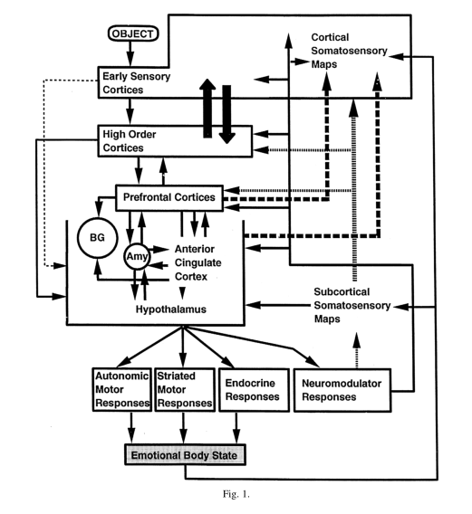

#Emotion in the perspective of an integrated nervous system.

##2. Emotion and feeling

The term emotion should be rightfully used to designate a collection of responses triggered from parts of the brain to the body, and from parts of the brain to other parts of the brain, using both neural and humoral routes. The end result of the collection of such responses is an **emotional state**, defined by changes within the body-proper, e.g., viscera, internal milieu, and within certain sectors of the brain, e.g., somatosensory cortices; neuro-transmitter nuclei in brain stem.
The term feeling should be used to describe the complex **mental state** that results from the emotional state.That mental state includes: 

1. the representation of the changes that have just occurred in the body-proper and are being signaled to body-representing structures in the central nervous system (or have been implemented entirely in somatosensory structures via ‘as-if-body-loops’); and it also includes
1. a number of alterations in cognitive processing that are caused by signals secondary to brain- to-brain responses, for instance, signals from neurotransmitter nuclei towards varied sites in telencephalon.

Both emotions and feelings are amenable to investigation, all the more so if their sequential and concurrent functional components can be relatively individualized for analysis along the model suggested by the above distinction. Emotion is somewhat more accessible than feeling because the triggering stimuli and sites are easier to identify, and because so many of the responses are externalized and thus easier to measure. But once the neural systems which can support feelings are identified, feelings are also accessible, especially in humans, using modern neuroimaging tools.

##3. Neural systems underlying emotion

Prominent among those structures are the cingulate cortex (usually used as shorthand for the anterior cingulate cortex), the amygdaloid nuclei (known collectively as the amygdalae), and the hypothalamus for those (authors who include the hypothalamus in the limbic system, which is not always the case). Although the term limbic system is often criticized I have no particular problem with retaining it. The notion of limbic system is helpful provided the term is seen as a convenience for communication and not as a suggestion that this odd collection of structures has a single function. But I do have a problem with the notion that only limbic system structures are seen as relevant for emotion; or that emotion and feeling are seen as happening within the limbic system; or that the results of emotion and feeling are thus relevant only within the limbic system.

Numerous structures outside of limbic system are involved in processing emotion and feeling. The list includes: (a) the prefrontal cortices, especially those in the ventral and medial sectors and, more broadly, in the orbital sector; (b) it also includes the somatosensory cortices, by which I refer not just to SI in the rolandic region but also to SII and to insular cortices; (c) monoamine nuclei in the brain stem; (d) periacqueductal gray; and (e) other nuclei both in the brain stem and spinal cord involved in both afferent and efferent signaling relative to viscera and internal milieu.

