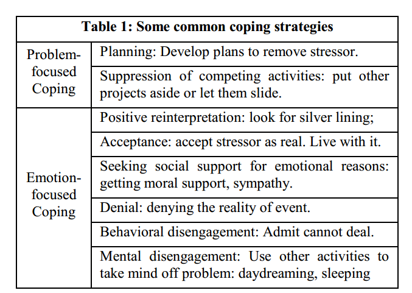

#Modelling coping behaviour 

[Article by Marsella and Gratch](http://people.ict.usc.edu/~gratch/MarsellaGratch-aamas03.pdf)
Based on Smith  and  Lazarus work:  

* *C.  Smith  and  R.  Lazarus.,  "Emotion  and  Adaptation,"  in Handbook  of  Personality:  theory  &  research,  Pervin,  Ed. NY: Guilford Press, 1990, pp. 609-637.*

# Appraisal and appraisal variables

*  goal  relevance  –  are  the  consequences  of  an  event  relevant to an organism’s goals
*  desirability – how desirable are the consequences
*  likelihood – how likely are the consequences
*  causal  attribution  –  who  is  the  causal  agent  underlying  the event and do they deserve credit or blame
*  coping potential – a measure of an agent’s ability to reverse negative or maintain positive circumstances.

[Scherer has much more interesting appraisal variables.](scherer_appraisal.md) 

# Coping

## Model of Appraisal

Events  are  represented  as  probabilistic  STRIPS  operators. 

## A MODEL OF COPING

See [M.Minsky The emotion machine: What are some useful “Ways to Think?”](http://web.media.mit.edu/~minsky/E7/eb7.html).

The selection of a coping strategy is a four-stage process: 

1. identify a  coping  opportunity,  
2. propose  alternative  coping  strategies, 
3. assess coping potential, 
4. select a strategy to apply.

### Identify coping opportunity:

1. Focus agency
1. Interpretation - objects
1. Agency - max
1. Max - interpretation
1. Potential responsibility

### Propose alternative coping strategies

Each strategy consists  of  two  parts,  a  set  of  conditions  that  define  its  applicability,  and  an  abstract  characterization  of  its  effect  on  the  causal
interpretation.

### Assess coping potential

The  assessment  of  coping  potential  takes  a  strategy’s  abstract effect  and  maps  it  into  one  or  more  elements  of  the causal interpretation  that,  if  changed,  would alter the appraisals in a desired way.    

### Select one strategy

Revised  NEO  Personality  Inventory  factors  correlate with coping [23]: 

*  Conscientiousness  is  associated  with  planful  coping  and negatively associated with self-blame and wishful thinking, 
*  Neuroticism is related to self-blame and daydreaming. 
*  Openness  is  associated  with  finding  positive  meaning/reinterpretation. 

## Coping Strategies
Table 2 illustrates our recasting of the strategies in Table 1.

### Planning

If  the  max  appraisal  associated  with  a  coping  elicitation  frame  is  positive  (e.g.,  a  desirable
state  was  achieved  or  may  be  achieved  in  the  future),  the  strategy  asserts  a  preference  to  maintain  this  state.    Alternatively,  if
the  max  appraisal  associated  with  the  coping  frame  is  negative (e.g.,  a  desirable  state  was  threatened)  the  strategy  identifies
actions that would overturn the threatening circumstances.

### Positive reinterpretation

Computationally,  this  means finding  some  direct  or  indirect  consequence  of  the  event  that  is desirable  and  emphasizing  it  by  increasing  its  utility  for  the agent.

### Acceptance 

Computationally,  this  corresponds  to  the  situation where  the  maximum  appraisal  is  a  threat  to  a  desirable  intended state.    Under  these  circumstances,  this  strategy  proposes  dropping  the  intention,  essentially  dropping  the  commitment  to achieve this state. Acceptance will lead to planner to stop the search for plans to achieve  the  desired  state.  

### Denial

The  strategy  is
proposed  if  the  most  intense  appraisal  associated  with  the  coping frame is negative. During the assessment of coping potential, rules  identify  factors  leading  to the  negative  appraisal  that  are candidates  for  denial.  If  selected,  one  of  these  candidates  is  manipulated to appear less likely.

### Mental disengagement 

Mental  Disengagement  acts  by  reducing  an  agents  “investment”  in  some  state  of  affairs.  Computationally,  this  corresponds  to identifying  a  previously  desired  state  or  goal  that  seems  unachievable  and  then  coping  by  reducing  the  intrinsic  utility  of that  state.

### Shift blame/Accept blame

The coping identifies potentially blameful individuals or causes for the event and shifts  blame  to  them.

### Composition of coping strategies.

    