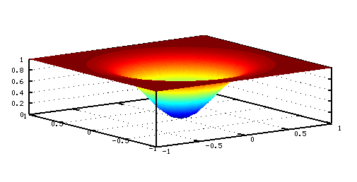

# Computational emotional thinking model

## Introduction

_TBD_

Marvin Minsky in his book "The emotion machine"[emotion_machine] described human thinking model.
He demonstrated that emotions are inseparable parts of thinking. There are several number of researchers that share this point of view on emotions. Rosalind Picard in her article[challenges] "Challenges of affective programming" states: "Although people are the most intelligent systems we know, and people’s emotion appears to play a vital role in regulating and guiding intelligence, it does not mean there might not be a better way to implement some of these goals in machines. It may be possible that there is something like the wheel, which has no precise human or animal equivalent, but which provides for some of the same locomotion goals. There may exist a kind of alien intelligent living system, something we’ve never encountered, which achieves its intelligence without having anything like emotion."

_TBD_

## Emotional thinking model

### Model basis

#### Minsky's Thinking model

First perspective that is used in this work is  computer science. We used Marvin Minsky emotional thinking approach.
Marvin Minsky in his book "The emotion machine"[emotion_machine] described human thinking model. Main structural idea that we used and adopted is "Model of six".
Model of six thinking levels:

1. Instinctive reactions
1. Learned reactions
1. Deliberative
1. Reflective thinking
1. Self-reflective thinking
1. Self-conscious reflections

All thinking processes are developed in levels listed above. Our assumption: emotions as part of thinking, at least conscious part, should fit thinking model. This way all emotional processed should be expressed in terms of thinking model(levels). This could be understood as base of computational emotional thinking approach.

#### Evolutionary psychology

The other perspective is psychology.  We use Plutchik approach[nature_of_emotion] as main psychological model. Plutchik indicated 8 basic emotions grouped in 4 pairs:

1. Joy - sorrow
1. Anger - fear
1. Acceptance - disgust
1. Surprise - expectancy

Emotions are organised in three dimensional circumplex model where third dimension is emotional strength. Basic emotions could be mixed based on color theory, in high-level, more complex emotions. Complex emotions based on two original are called "primary dyads":

1. Love
1. Submission
1. Awe
1. Disapproval
1. Remorse
1. Contempt
1. Aggressiveness
1. Optimism

More complex emotions based on three could be combined in similar way, see Cambria [sentic_computing].
Cambria [hourglass_of_emotions] used Gauss function to describe passage from a sentic level to another. We interpreted it as: Gaussian function regulates influence of subjective human perception of inbound stimulus over objective brain response. Semir Zeki[Neural_Correlates_of_Hate] describes neural activities correlation to emotion(hate) as Gaussian.

#### Neuromodulation theory

Third basis of emotional thinking model is neuroscience. Objective brain work is described as neuromodulation process in Fellous(1999) and Arbib & Fellous (2004) with base of four neuromodulatory systems:

1. Dopamine
1. Serotonin
1. Opioids

Close to their work is model based on monoamine neurotransmitters called "Cube of emotions" of Hugo Lövheim[Cube_of_emotions].
Author describes emotions and correlation to neurotransmitters concentration. Using only three main neurotransmitters:

1. Nor-adrenaline
1. Dopamine
1. Serotonin

Lövheim uses three dimensional model-cube and assumes that all emotional states could be described as mixture of main affective states that are inherited from affect theory of Tomkins (Tomkins (1962); Tomkins (1963); Tomkins (1991); Tomkins (1981)):

Positive:
 1. Enjoyment/Joy
 1. Interest/Excitement
 1. Surprise
 1. Anger/Rage
 1. Disgust
 1. Distress/Anguish
 1. Fear/Terror
 1. Shame/Humiliation

This group of affects does match the basic Plutchik's emotions except for humiliation that could be interpreted as contempt. Complete mapping description is presented below.

According to Arbib et al(2004) there are four following neuronal systems involved in to emotional processing:

1. Spinal cord
1. Hypothalamus
1. Amygdala
1. Orbitofrontal cortex

We correspond roughly spinal cord, hypothalamus and amygdala with instinctive layer of Minsky's thinking model. This mapping is done in the assumption that reflexes, drives and instincts could be placed in instinctive reactions layer responsible for most primitive actions that do not involve conscious reactions or more complex processes like learned reactions or deliberations.

### Emotions in six thinking levels

This is attempt to synthesize theory based on three approaches. First of all we described Plutchik's feedback loops[nature_of_emotion] in Minsky's six thinking levels.

Figure 1. [Emotions in model of six thinking levels].

1. Inbound stimulus is been processed(transmitted/apprised) via spinal cord, hypothalamus, amygdala and all these neuronal systems take part in neuromodulation.
1. Neuromodulation actually triggers the emotional state of human and all the rest actions are done under the influence of neuromodulatory systems: nor-adrenaline, dopamine, serotonin.
1. Instinctive behavior is processed on lover
1. Stimulus cognition is processed in cingulate cortex, frontal cortex (working memory) that we correspond to rest 5 layers of thinking model. Stimulus cognition actions is done in the emotional state.

#### Stimulus appraisal and stimulus cognition

_TBD_

1. Inbound stimulus is apprised first on instinctive level.
2.

#### Feeling the state

#### Neuromodulation

#### Instinctive and conscious behavior

#### Effect

#### Higher emotions

#### Neuromodulation to computer system management mapping

#### Conformity with Picard criteria

## Conclusion

## References

Author, A. A. (2005). Title of work. Location/City, State: Publisher.

Arbib, M.A., & Fellous J. M. (2004). Emotions: from brain to robot. Trends in Cognitive Sciences, 8(12), 554-559
Fellous, J.M. (1999) Neuromodulatory basis of emotion. The Neuro-scientist 5, 283–294
Tomkins, S. (1962). Affect imagery consciousness volume I the positive affects. New York: Springer Publishing Company.
Tomkins, S. (1963). Affect imagery consciousness volume II the negative affects. New York: Springer Publishing Company.
Tomkins, S. (1991). Affect imagery consciousness volume III the negative affects anger and fear. New York: Springer Publishing Company.
Tomkins, S. (1981). The quest for primary motives: biography and autobiography of an idea. J Pers Soc Psychol, 41, 306–335.
